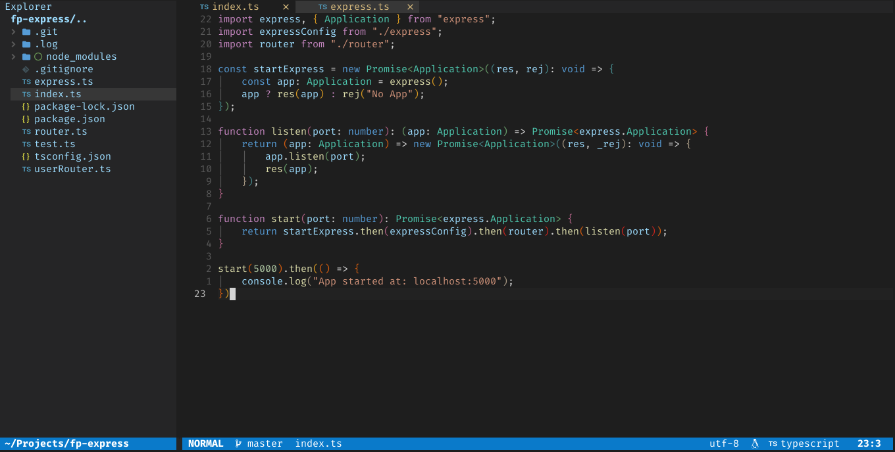

<h1 align="center">codedark.nvim</h1>

A Lua port of [vim-code-dark](https://github.com/tomasiser/vim-code-dark) colorscheme for [neovim](https://neovim.io/) 



## 🌈 Color Palette


## #️ Supported Plugins
- [LSP](https://github.com/neovim/nvim-lspconfig)
- [Treesitter](https://github.com/nvim-treesitter/nvim-treesitter)
- [nvim-compe](https://github.com/hrsh7th/nvim-compe)
- [Telescope](https://github.com/nvim-telescope/telescope.nvim)
- [NvimTree](https://github.com/kyazdani42/nvim-tree.lua)
- [BufferLine](https://github.com/akinsho/nvim-bufferline.lua)
- [Git Signs](https://github.com/lewis6991/gitsigns.nvim)
- [Git Gutter](https://github.com/airblade/vim-gitgutter)
- [Lualine](https://github.com/hoob3rt/lualine.nvim)

## ⬇️ Installation

Install via package manager

 ```lua
 -- Using Packer:
 use 'Mofiqul/codedark.nvim'
 ```

```vim
" Using Vim-Plug:
Plug 'Mofiqul/codedark.nvim'
```
## 🚀 Usage

```lua
-- Lua:
vim.cmd[[colorscheme codedark]]

```
```vim
" Vim-Script:
colorscheme codedark
```

If you are using [`lualine`](https://github.com/hoob3rt/lualine.nvim), you can also enable the provided theme:
> Make sure to set theme as 'codedark-nvim' as codedark already exists in lualine built in themes

```lua
require('lualine').setup {
  options = {
    -- ... 
    theme = 'codedark-nvim'
    -- ... 
  }
}'
```

## 🍭 Extra 
-  [Kitty](https://sw.kovidgoyal.net/kitty/) color scheme

## 💉 Terminal support

### If the colors seem to be wrong
If your terminal supports 256 colors (see [this script](http://www.robmeerman.co.uk/unix/256colours)) you can set:

```lua 
-- Lua:
vim.g.codedark_term256 = 1
```

```lua 
-- Vim-Script:
let g:codedark_term256=1
```

## ❓ FAQ

### What is and how to enable the conservative mode?
If you don't like many colors and prefer the **conservative style of the standard Visual Studio**, you can try the conservative mode with reduced number of colors. To enable it, put the following line to your `init.vim` or `init.lua` *before* setting the scheme, like so:

```lua
-- Lua:
vim.g.codedark_conservative = 1
vim.cmd[[colorscheme codedark]]
```

```vim
" Vim-Script:
let g:codedark_conservative = 1
colorscheme codedark
```

### Something is broken but I know how to fix it!
Pull requests are welcome! Feel free to send one with an explanation!
