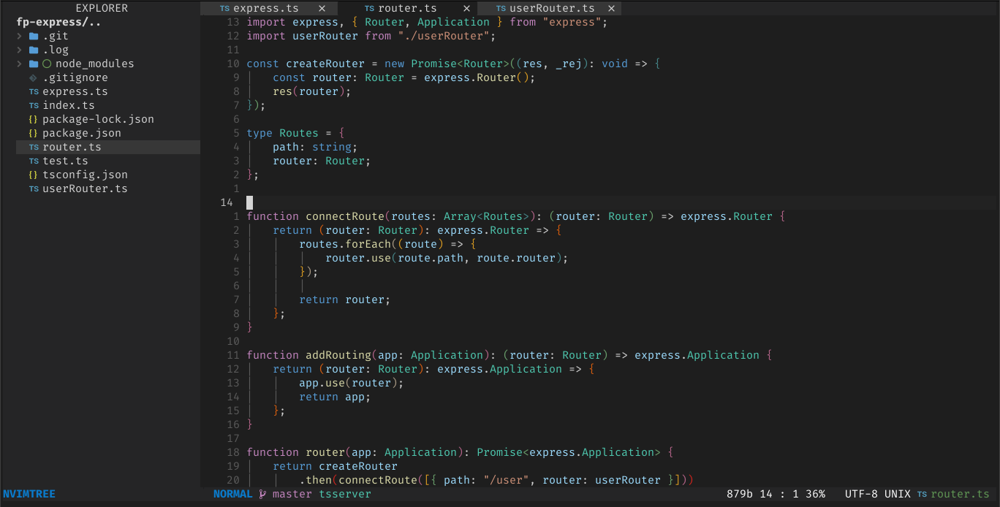
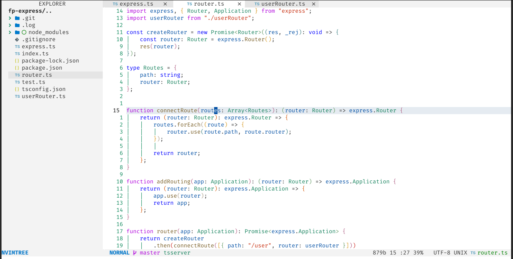

<h1 align="center">vscode.nvim</h1>

vscode.nvim (former codedark.nvim) a Lua port of [vim-code-dark](https://github.com/tomasiser/vim-code-dark) colorscheme for [neovim](https://neovim.io/) with vscode light and dark theme

## Dark 


## Light


## #️ Supported Plugins
- [LSP](https://github.com/neovim/nvim-lspconfig)
- [Treesitter](https://github.com/nvim-treesitter/nvim-treesitter)
- [nvim-compe](https://github.com/hrsh7th/nvim-compe)
- [Telescope](https://github.com/nvim-telescope/telescope.nvim)
- [NvimTree](https://github.com/kyazdani42/nvim-tree.lua)
- [BufferLine](https://github.com/akinsho/nvim-bufferline.lua)
- [Git Signs](https://github.com/lewis6991/gitsigns.nvim)
- [Git Gutter](https://github.com/airblade/vim-gitgutter)
- [Lualine](https://github.com/hoob3rt/lualine.nvim)

## ⬇️ Installation

Install via package manager

 ```lua
 -- Using Packer:
 use 'Mofiqul/vscode.nvim'
 ```

```vim
" Using Vim-Plug:
Plug 'Mofiqul/vscode.nvim'
```
## 🚀 Usage

```lua
-- Lua:
-- For dark theme
vim.cmd[[set background=dark]]
-- For light theme
vim.cmd[[set background=light]]
vim.cmd[[colorscheme vscode]]

```
```vim
" Vim-Script:
" For dark theme
set background=dark
" For light theme
set background=light
colorscheme vscode
```

If you are using [`lualine`](https://github.com/hoob3rt/lualine.nvim), you can also enable the provided theme:


```lua
require('lualine').setup {
  options = {
    -- ... 
    theme = 'vscode'
    -- ... 
  }
}'
```

## 🍭 Extra 
-  [Kitty](https://sw.kovidgoyal.net/kitty/) color scheme


### Something is broken but I know how to fix it!
Pull requests are welcome! Feel free to send one with an explanation!
